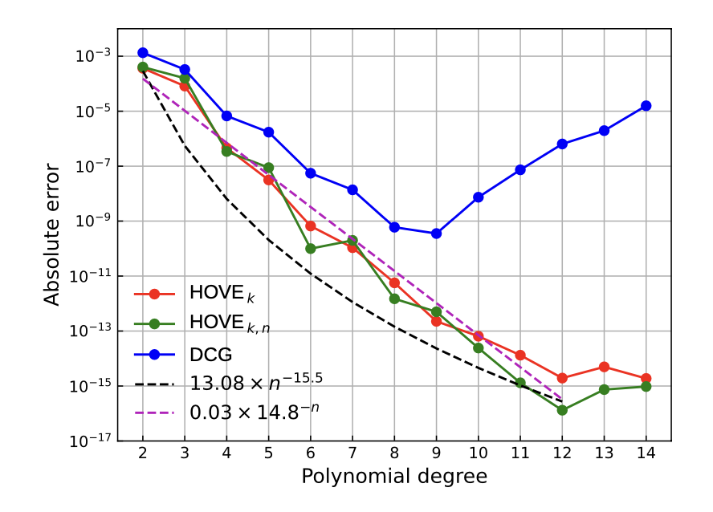

`surfgeopy` is a Python package that is freely available and open-source. Its purpose is to calculate approximations of surface integrals over smooth embedded manifolds.

## 🎉Table of Contents

- [Background](#background)
- [Install](#install)
- [Usage](#usage)
- [Development team](#develpment-team)
- [Contributing](#contributing)
- [License](#license)

## Background

`surfgeopy` rests on curved surface triangulations realised due to $k^{\text{th}}$-order interpolation of the closest point projection, extending initial linear surface approximations. It achieves this by employing a novel technique called square-squeezing, which involves transforming the interpolation tasks of triangulated manifolds to the standard hypercube using a cube-to-simplex transformation that has been recently introduced.
To ensure the stability and accuracy of the computations, surfgeopy leverages classic Chebyshev-Lobatto grids. These grids enable the calculation of high-order interpolants for the surface geometry while avoiding Runge's phenomenon, a common issue in numerical analysis.


## Surface approximation using polynomial interpolation!

Consider an element $T_{i}$ in a reference surface $S_h$. We consider the affine transformation and closest point projection:

- $\tau_i : \Delta_2 \rightarrow T_i$
- $\pi_i : T_i \rightarrow S$

Setting

- $\varphi_i : \Omega \rightarrow S, \quad \varphi_i = \pi_i \circ \tau_i\circ \sigma$
where $\sigma$ is a mapping from the reference triangle $\Delta_2$ to the physical triangle $T_i$.

Let

- $q_i(\mathrm{x})= \sum_{\alpha \in A_{2,n}} \varphi_i(p_\alpha)L_{\alpha}(\mathrm{x})$
be an $n^{\text{th}}$-order polynomial (Newton) interpolation of the mapping $\varphi_i$ on $\Omega$.

Then,

- $T_n = {q_i,\Omega,q_i(\Omega)}_{i=1,\dots,N}$
is an $n^{\text{th}}$ order approximation of the smooth surface $S$.


## Square-triangle transformation

- Square-triangle transformations: Deformations of an equidistant grid (left picture)  under Duffy's transformation (middle picture) and square-squeezing  (right picture)


 <h2 align="center">
💝 Results ! 💝
</h2>                      





## Refinement  

As a refinement procedure, we use the so called triangular quadrisection when the initial triangle is replaced with four triangles until a certain tol is reached. Triangular quadrisection is a linear subdivision procedure which inserts new vertices at the edge midpoints of the input mesh,  thereby producing four new faces for every face of the original mesh:
 
                      x3                        x3
                     /  \      subdivision     /  \
                    /    \        ====>       v3__v2
                   /      \                  / \  / \
                 x1________x2              x1___v1___x2
 
                       Original vertices : x1, x2, x3
 
                       New vertices      : v1, v2, v3
 
                       New faces         : [x1 v1 v3; x2 v2 v1; x3 v3 v2; v1 v2 v3] 
                      


## 🎉 Roadmap

 We are currently working on:

- Incorporating distmesh for generating mesh in python 
- Extending HOSQ  for a wide range of non-parametrized surfaces 

More Coming soon...

### 🛠️ Install

Since this implementation is a prototype, we currently only provide the installation by self-building from source. We recommend to using `git` to get the `surfgeopy` source:

```bash
git clone https://codebase.helmholtz.cloud/interpol/surfgeopy.git
```

> 🚧 Switch to the `conda` or `venv` virtual environment of your choice where you would like to install the library.

From within the environment, install using [pip],

```bash
pip install -e .
```

The `-e` argument specifies to install softlinks so that any changes made by the user to the source in the source folders are reflected in the install when importing modules.

> You **must not** use the command `python setup.py install` to install `surfgeopy`,
as you cannot always assume the files `setup.py` will always be present
in the further development of `surfgeopy`.

## 🥳 Usage

Documentation is a WIP. Please refer to the example Jupyter notebooks in the 👉 `examples/` directory to get started with the library.

## 👷 Development team

### Main code development
- Gentian Zavalani (HZDR/CASUS) <g.zavalani@hzdr.de>

### Mathematical foundation
- Gentian Zavalani (HZDR/CASUS) <g.zavalani@hzdr.de>
- Oliver Sander (TU Dresden) <oliver.sander@tu-dresden.de>
- Michael Hecht (HZDR/CASUS) <m.hecht@hzdr.de>


### Acknowledgement
- Minterpy development team


## Reference
👉 If you use `surfgeopy` in a program or publication, please
acknowledge its authors by adding a reference to the paper
below.

```bibtex
@article{...,
  title={HIGH-ORDER-INTEGRATION FOR REGULAR EMBEDDED MANIFOLDS},
  author={Zavalani, G., Sander, O. and Hecht, M.},
  journal={arXiv preprint arXiv:...},
  year={2023}
}
```

## Contributing

👉 [Open an issue](https://codebase.helmholtz.cloud/interpol/surfgeopy/-/issues) or submit PRs.


## License

[MIT](LICENSE)

